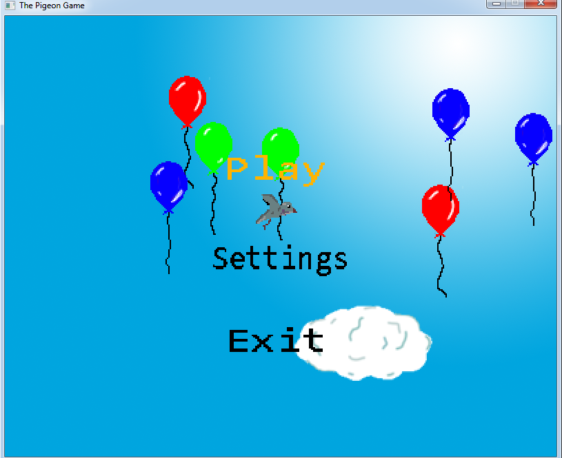
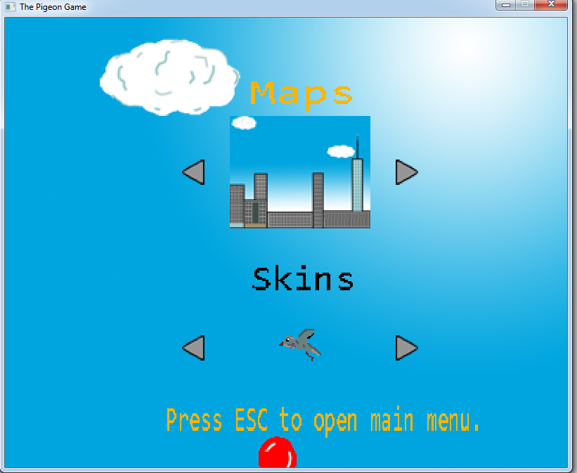
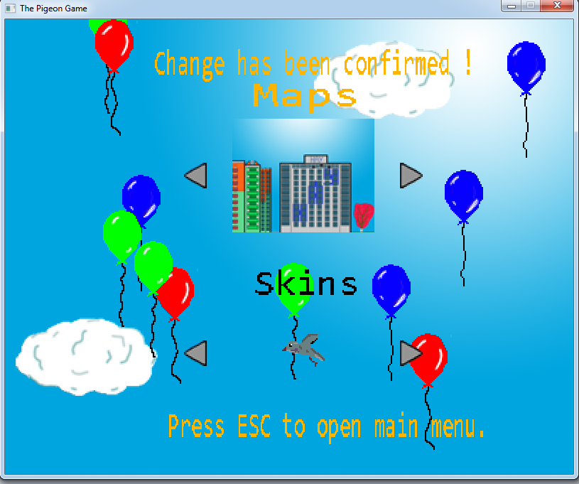
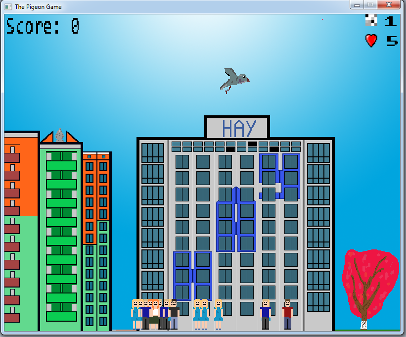
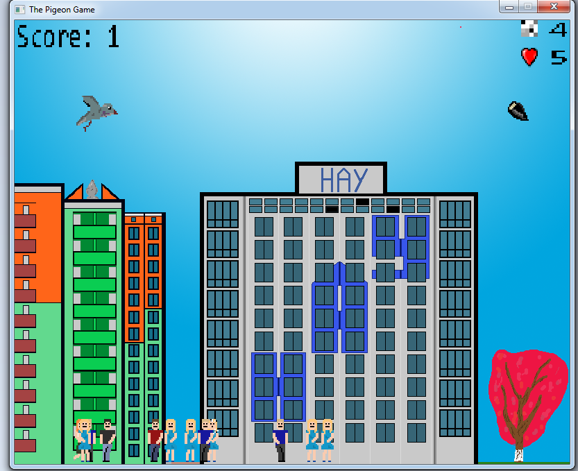
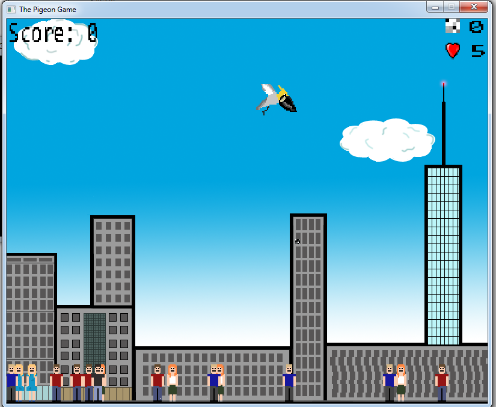
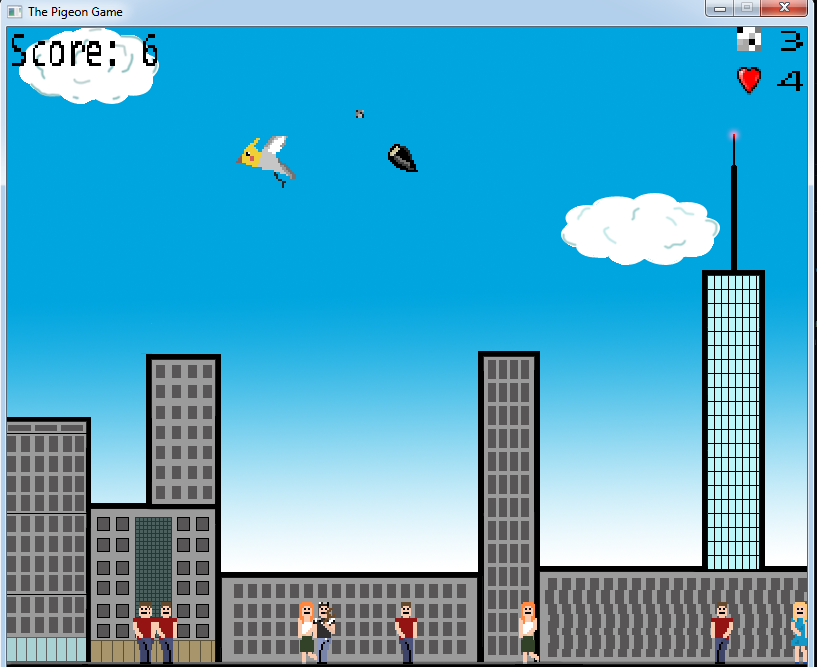
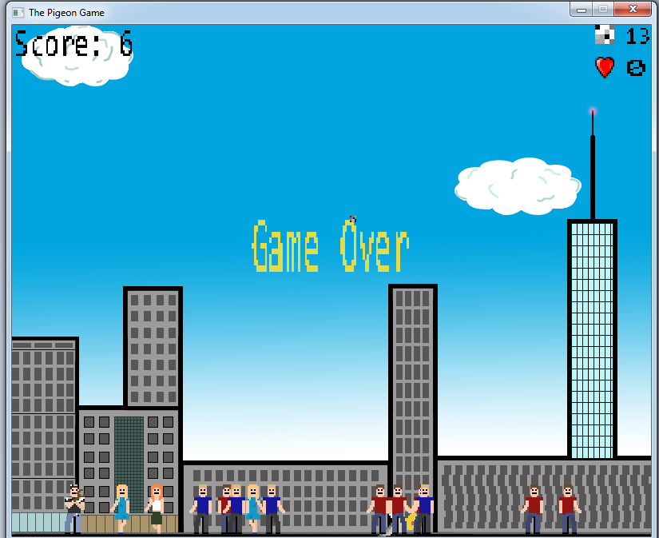

# PigeonGame

### Проект старый и был использован для изучения ООП

2D игра в жанре аркада, суть которой заключается в следующем: игрок - голубь, цель которого попадать по врагам. Есть два типа врагов - обычные и агрессивные. Если игрок один раз попадет по агрессивному врагу, то тот будет в ответ стрелять в игрока. 

У голубя есть несколько показателей - кол-во "патронов" и очки жизней. При нулевом значении "паторонов" игрок не может совершать выстрелы, при нулевом значении очков жизней игра заканчивается проигрышем. Выиграть невозможно, можно лишь набирать очки. Значение патронов можно восполнять семечками, которые появляются в рандомном месте и время.

В игре можно выбрать задний фон(всего их 4 штуки) и внешний вид игрок(всего 2 штуки).

Скриншоты игры:

